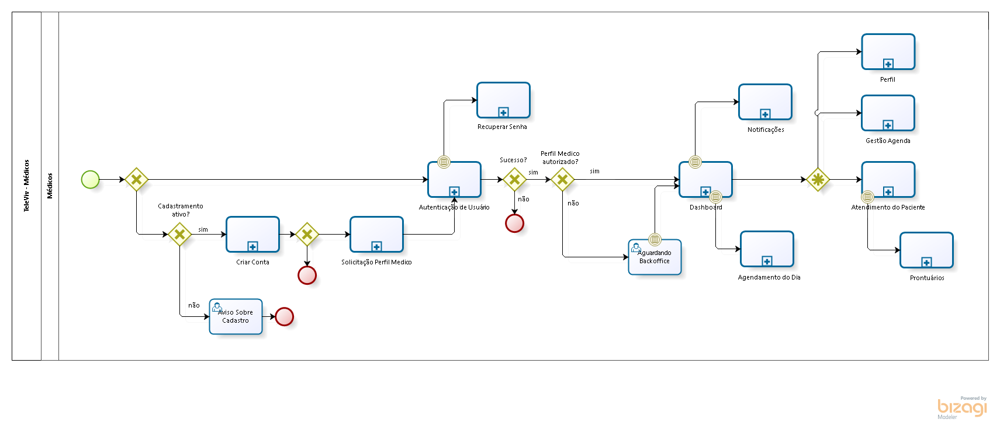
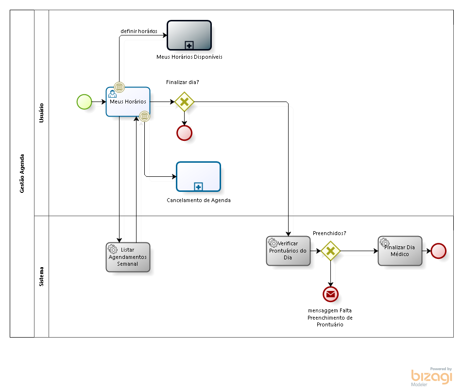
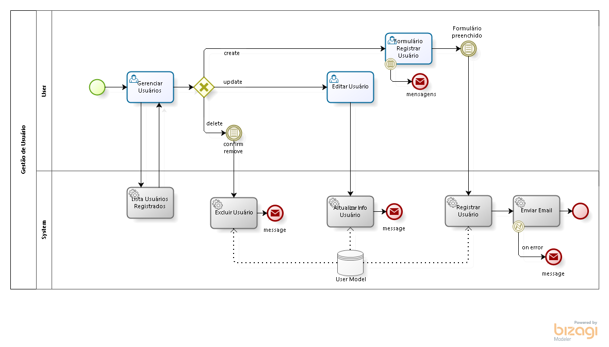

# Mapeamento de processos

## Macroprocesso - TeleViv

<figure><figcaption></figcaption></figure>

&#x20;O macroprocesso demonstra como a plataforma TeleViv funcionará. Para acessá-la é necessário que o usuário possua uma conta, caso seja a primeira vez, a plataforma indicará que o usuário faça o registro. No registro, o usuário fará a escolha do plano de assinatura que deseja ter, após o preenchimento das estapas ele já terá acesso a dashboard, nela o usuário pode configurar as assinaturas, acessar o perfil, agendar consultas, acessar ao próprio prontuário, além de gerenciar a própria conta.&#x20;

### Primeiro acesso

<figure><figcaption></figcaption></figure>

O primeiro acesso acontece quando o usuário faz o registro da conta e loga pela primeira vez. O sistema irá disponibilizar um código de confirmação assim que o usuário preencher as credencias para o loggin, depois de confirmar o código ele já estará logado.

### Autenticação de usuário

<figure><figcaption></figcaption></figure>

A autenticação do usuário começa na página de login. Após colocar as credenciais o sistema irá perguntgar se existe um 2FA Code, caso o usuário possua será autenticado em seguida, caso ele não possua será autenticado apenas com o login comum.

### Perfil - usuário

<figure><figcaption></figcaption></figure>

O Perfil apresenta as informações do usuário, neste espaço ele pode colocar foto, fazer a configuração 2FA, definir uma nova senha e confirmar/excluir a conta.

### Configuração 2FA

<figure><figcaption></figcaption></figure>

A configuração 2FA é habilitada pelo usuário e o sistema gera o código possibilitando que o usuário entre com a chave 2FA.

### Redefinir senha

<figure><figcaption></figcaption></figure>

A redefinição de senha acontece com os seguintes passos: primeiro o usuário acessa a área do - esqueci minha senha - depois insere a forma que deseja receber o código de recuperação - celular ou e-mail registrados na palataforma - se todas as informações estiverem corretas, o sistema envia um código para começar o processo de troca de senha.

### Criar conta - Cliente/Paciente

<figure><figcaption></figcaption></figure>

Para criar a conta como paciente é necessário disponibilizar as seguintes informações: Nome, e-mail ou celular, uma senha e CPF, depois preencher um formulário, aceitar os termos e política. Depois de tudo feito, o sistema irá enviar um código de ativação de conta para o e-mail ou celular registrado, após preencher o espaço do código a conta já estará pronta para ser usada.

### Dashboard - Cliente/Paciente

<figure><figcaption></figcaption></figure>

A Dashboard do paciente possui as informações do usuário, a lista de consultas finalizadas e a lista da consulta do dia.

### Escolha de assinaturas

<figure><figcaption></figcaption></figure>

Para escolher um assinatura ou plano, o usuário paciente irá pedir para exibir a lista, depois selocionará um plano ou assinatura, após a escolh aparecerá a opção de pagamento, feito isto, o plano será registrado no perfil do usuário paciente.

### Assinaturas - cliente/paciente

<figure><figcaption></figcaption></figure>

O acesso ao menu das assinaturas do paceinte permite que ele veja o CRUD do Plano de assinaturas e também altere o método de pagamento, caso queira, além de mostrar os planos ativos e o histórico de pagamento.

### Agendamentos de consulta

<figure><figcaption></figcaption></figure>

As consultas agendadas aparecerão quando o usuário paciente clicar no local para vê-las, aparecerá a lista com as consultas agendadas, ele poderá acessar mais detalhes dela, podendo reagendar a consulta ou cancelar a consulta (apenas para planos avulsos).

### Cancelar consultas agendadas

<figure><figcaption></figcaption></figure>

Para cancelar uma consulta será necessário que o paciente informe o motivo do cancelamento, o sistema irá criar a solicitação de cancelamento podendo ser aprovado ou não, caso seja aprovado ou rejeitado, o paciente será notificado.

### Prontuário - Paciente

<figure><figcaption></figcaption></figure>

O prontuário do paciente é um arquivo que deve ser adicionado. Nele estarão as informações de pré-atendimento e as informações que deverão ser adicionadas após a consulta.

### Solicitar perfil Médico

<figure><figcaption></figcaption></figure>

Para solicitar um perfil de médico é necessário o preenchimento de algumas informações com o upoload do CRM e documentos, após esse passo, o sistema verificará a solicitação, podendo aprová-la ou não. Se a solicitação for ou não aprovada o usuário será notificado.

### Criar conta - Médico

<figure><figcaption></figcaption></figure>

Para criar a conta como médico é necessário disponibilizar as seguintes informações: Nome, e-mail ou celular, uma senha e CPF, depois preencher um formulário com o CRM, aceitar os termos e política. Depois de tudo feito, o sistema irá enviar um código de ativação de conta para o e-mail ou celular registrado, após preencher o espaço do código a conta já estará pronta para ser usada.

### Dashboard - Médico

<figure><figcaption></figcaption></figure>

A Dashboard do Médico possui as opções de ver as atividades/consultas diárias - tempo e quantidade - os pacientes que foram atendidos e os pacientes que são atendidos diariamente.

### Perfil - Médico

<figure><figcaption></figcaption></figure>

O perfil de médico começa com a criação de conta e pedido para ser um perfil de médico, passa para a autenticação de usuário - quando o perfil de médico é autorizado pelo backoffice as opções da dashboard aparecem, são elas: configurar o próprio perfil, gerir a agenda, atendimento de pacientes e os prontuários deles.

### Gestão de agenda - Médico

<figure><figcaption></figcaption></figure>

A gestão de agenda é feita pelo próprio usuário médico. Aqui ele poderá organizar e listar os horários disponíveis par as consultas, podendo cancelar a agenda também. Além disso, o médico pode verificar os prontuários do dia.

### Prontuários - Médico

<figure><figcaption></figcaption></figure>

Os prontuários que o médico tem acesso são os dos pacientes que ele irá ou já atendeu. Aqui os prontuários podem ser achados por nome, clicando no prontuário desejado o médico terá detalhes sobre ele.

### Cancelar agenda

<figure><figcaption></figcaption></figure>

Para cancelar a agenda o médico precisa confirmar o cancelamento e, assim, o sistema poderá notificar o paciente.

### Atendimento/ consulta

<figure><figcaption></figcaption></figure>

O atendimento é feito após o medico selecionar o paciente que está agendado, depois ele terá acesso ao prontuário do paciente e poderá colocar as norvas informações que surgirem na consulta, depois de atender o paciente e salvar as informações da consulta, ela será finalizada.

### Agendamentos do dia - Médico

<figure><figcaption></figcaption></figure>

Para acessar aos agendamentos do dia, o médico irá ao próprio perfil e na gestão de agenda encontrará todos os pacientes que realizarão consutas no dia.

### Notificações

<figure><figcaption></figcaption></figure>

As notificações acontecem para todos os usuários, tanto para os pacientes como para os médicos. Os alertas podem ser deletados após a leitura.

### Backoffice

<figure><figcaption></figcaption></figure>

Para acessar ao Backoffice é necessário ser um usuário administrativo/administrador. Ao entrar no backoffice do TeleViv o usuário administrador precisará colocar as credenciais, caso seja o primeiro acesso, o sistema irá abrir uma página para que o usuário seja cadastrado, depois poderá logar normalmente. Dentro do backoffice o usuário admnistrador tem as opções de: gerenciar consultas, ver e aceitar as solicitações de perfis médicos, gerir assinaturas e o controle de acesso.

### Controle de aceso

<figure><figcaption></figcaption></figure>

O controle de acesso disponibiliza duas opções dentro dele, são elas: gestão de usuários e a gestão de funçoes.&#x20;

### Dashboard Backoffice

<figure><figcaption></figcaption></figure>

A dashboard do backoffice permite que o administrador veja as solicitações de novos usuários médicos, catalogar usuários pacientes por gênero, catalogar médicos por especialidade clínica e listar quais são as especialidades mais agendadas.

### Gerenciamento de usuário

<figure><figcaption></figcaption></figure>

O gerenciamento de usuário é feito por um administrador, apenas o administrador pode criar/ registrar, fazer update ou remover usuários.

### Gerenciamento de Assinaturas

<figure><figcaption></figcaption></figure>

O gerenciamento de assinaturas é feito por um administrador, somente ele pode ter acesso a todas as listas de assinatura e alterar o status de um usuário.

### Gerenciamento de funções

<figure><figcaption></figcaption></figure>

O gerenciamento de funções é feito por um administrador, apenas ele pode criar, editar ou remover funções dentro do sistema.

### Gerenciar novos Médicos&#x20;

<figure><figcaption></figcaption></figure>

A habilitação de novos médicos é feita por um administrador, apenas ele pode cadastrar novos perfis de médicos.

### Gerenciar planos e assinaturas

<figure><figcaption></figcaption></figure>

Os planos de assinaturas são gerenciados por um administrador, ele possui as listas dos planos que estão ativos e pode atualizar planos já existentes ou criar novos.
