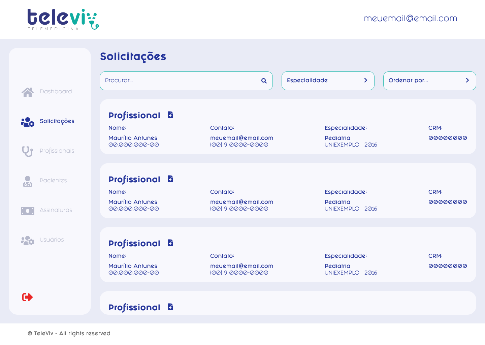

# Avaliar profissional

### PROPOSTA DE VALOR

| Como um               | Eu quero              | Então                     |
| --------------------- | --------------------- | ------------------------- |
| Usuário administrador | avaliar profissionais | habilitar o acesso a eles |

### CRITÉRIOS DE ACEITAÇÃO

* Estar autenticado;
* Ter permissão para avaliar os usuários;

### IMAGENS

<figure><figcaption></figcaption></figure>

<figure><figcaption></figcaption></figure>

### HISTÓRIA DO USUÁRIO


**Atores**: Adminstrador



**Fluxo principal:**

1. Usuário acessa a lista de profissionais pendentes
   1. Sistema exibe lista com solicitações
2. Usuário seleciona uma solicitação
   1. Caso o usuário clique em "Recusar"
      1. Sistema cancela solicitação para o usuário
   2. Caso o usuário clique em "Aceitar"
      1. Sistema confirma o usuários
      2. Sistema habilita acesso para o usuário
3. Fim do Fluxo.

**Pós-condição:**

1. Profissional pode acessar plataforma

**Mensagens**:


### CENÁRIOS

```gherkin
```
