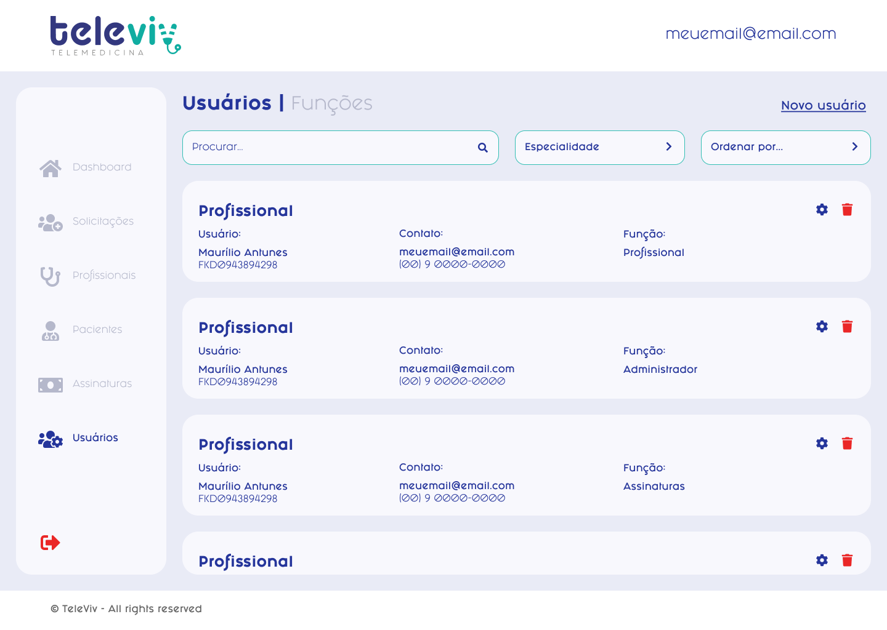

# Cadastrar usuário

### PROPOSTA DE VALOR

| Como um               | Eu quero               | Então     |
| --------------------- | ---------------------- | --------- |
| Usuário administrador | inserir novos usuários | cadastrar |

### CRITÉRIOS DE ACEITAÇÃO

* Estar autenticado;
* Ter permissão para cadastrar os usuários.

### IMAGENS

<div>

<figure><figcaption></figcaption></figure>

 

<figure><figcaption></figcaption></figure>

</div>

### HISTÓRIA DO USUÁRIO


**Atores**: Administrador



**Fluxo principal:**

1. Usuário acessa a lista de usuários administradores
   1. Sistema exibe lista usuários
2. Usuário clica em "Cadastrar usuário"
   1. Sistema exibe modal de registro
3. Usuário insere novos \<dados>
   1. Se o usuário clica em "Salvar"
      1. Caso o \<dado> seja válido
         1. Sistema salva as novas informações
      2. Caso o \<dado> não seja válido
         1. Mensagem de erro (1)
         2. Usuário não pode prosseguir
4. Fim do Fluxo.

**Pós-condição:**

1. Registrar usuário admin

**Mensagens**:

* Mensagem (1): "Campo invalido!"


### CENÁRIOS

```gherkin
```
