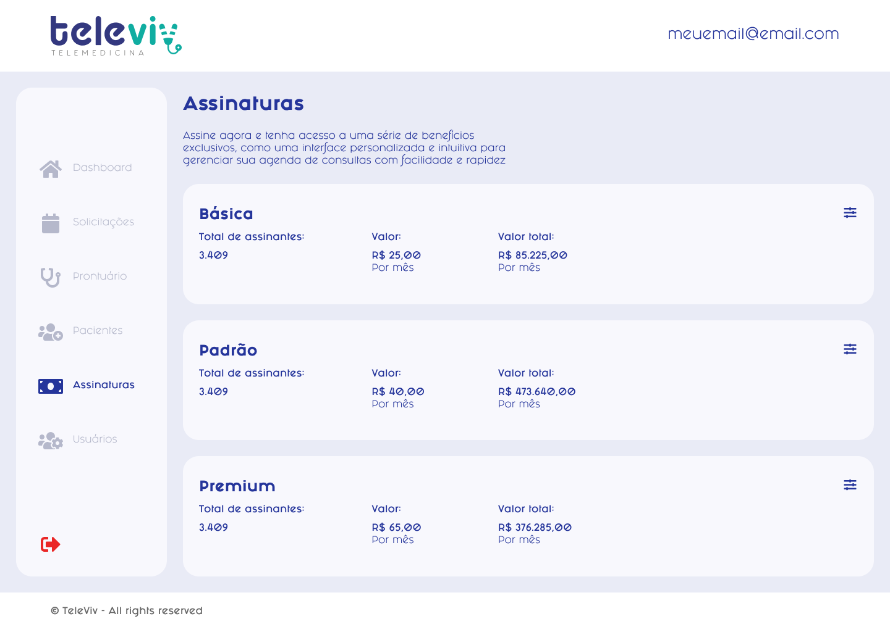

# Gerenciar assinaturas

### PROPOSTA DE VALOR

| Como um               | Eu quero                               | Então                 |
| --------------------- | -------------------------------------- | --------------------- |
| Usuário administrador | gerenciar as assinaturas da plataforma | editar as assinaturas |

### CRITÉRIOS DE ACEITAÇÃO

* Estar autenticado;
* Ter permissão para gerenciar assinaturas;

### IMAGENS

<div>

<figure><figcaption></figcaption></figure>

 

<figure><figcaption></figcaption></figure>

</div>

### HISTÓRIA DO USUÁRIO


**Atores**: Administrador



**Fluxo principal:**

1. Usuário acessa a lista de assinaturas
   1. Sistema exibe lista de assinaturas
2. Usuário clica no ícone de editar
   1. Caso o \<parâmetro> seja válido
      1. Usuário pode prosseguir
   2. Caso o \<parâmetro> seja inválido
      1. Mensagem de alerta (1);
      2. Botão `Salvar` fica desabilitado
3. Usuário clica em Salvar
   1. Sistema altera informações da assinatura
4. Fim do Fluxo.

**Pós-condição:**

1. Assinatura é editada

**Mensagens**:

* Mensagem (1): "Campo inválido!"


### CENÁRIOS

```gherkin
```
