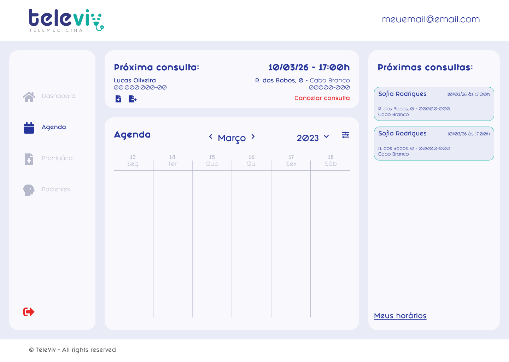

# Meus horários

### PROPOSTA DE VALOR

| Como um      | Eu quero                        | Então                 |
| ------------ | ------------------------------- | --------------------- |
| Profissional | Definir meu horário de trabalho | Definir meus horários |

### CRITÉRIOS DE ACEITAÇÃO

* Sistema deve definir horário padrão:
  * Entrada: 08:00
  * Descanso: 12:00
  * Volta do descanso: 13:00
  * Saida: 17:00
* Usuário pode definir o próprio horário

### IMAGENS

<div>

<figure><figcaption></figcaption></figure>

 

<figure><figcaption></figcaption></figure>

</div>

### HISTÓRIA DO USUÁRIO


**Atores**: Usuário



**Fluxo principal:**

1. Usuário acessa a área de agenda
2. Usuário clica no ícone de configuração
   1. Sistema exibe um modal "Meus horários"
      1. Caso o usuário não tenha definido nenhum horário
         1. Sistema exibe horario padrão
3. Usuário seleciona os dias da semana
   1. Caso o usuário tenha selecionado ao menos 1 dia de trabalho
      1. Usuário pode prosseguir
   2. Caso o usuário não tenha selecionado nenhum dia de trabalho
      1. Botão "Salvar" fica desabilitado
      2. Mensagem de alerta (1);
4. Usuário seleciona os \<horarios>
   1. Caso o usuário tenha selecionado um \<horario> valido
      1. Usuário pode prosseguir
   2. Caso o usuário tenha selecionado um \<horario> invalido
      1. Botão "Salvar" fica desabilitado
      2. Mensagem de alerta (2);
5. Usuário clica em Salvar
   1. Sistema define novos horarios de trabalho
6. Fim do fluxo

**Pós-condição:**

1. Usuário define horario de trabalho

**Mensagens**:

1. mensagem (1): "Escolha ao menos um dia!"
2. mensagem (2): "Código inválido!"


### CENÁRIOS

```gherkin
```
